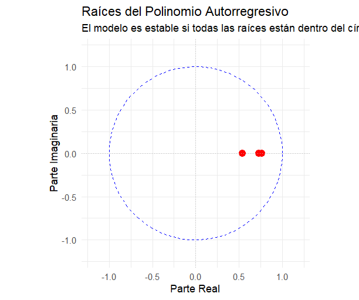

Análisis econométrico: IED, PIB y empleo industrial en Ecuador by Econ. Jean Pierre Soledispa Sacon

Descripción: Este proyecto analiza la relación entre la Inversión Extranjera Directa (IED), el Producto Interno Bruto (PIB) y el empleo en Ecuador, utilizando modelos de series temporales.

Objetivo: Evaluar el impacto de la IED sobre el empleo en diferentes sectores económicos mediante técnicas econométricas.

Metodología
•	Limpieza y transformación de datos
•	Pruebas de estacionariedad (ADF)
•	Diferenciación de series
•	Modelos VAR / BVAR
•	Análisis de funciones impulso-respuesta (IRF)

Herramientas
•	R
•	Excel
•	Series de tiempo

Resultados
•	Se identificaron relaciones dinámicas entre la IED y el empleo
•	El modelo mostró estabilidad (raíces < 1)
•	Evidencia de impacto en ciertos sectores

Estructura del proyecto
•	/data → datos utilizados
•	/scripts → código en R
•	/outputs → resultados y gráficos

Resultados

Convergencia MCMC
El modelo muestra una adecuada convergencia de las cadenas MCMC, indicando estabilidad en la estimación bayesiana.

Raíces del modelo
Todas las raíces se encuentran dentro del círculo unitario, lo que confirma la estabilidad del modelo VAR.

Shock IED → Empleo y PIB
Se observa el impacto dinámico de la inversión extranjera directa sobre el empleo y la actividad económica.

